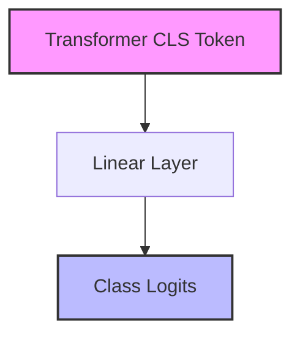
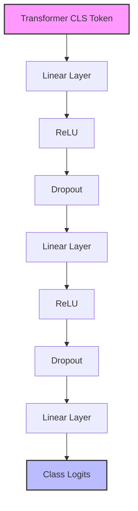
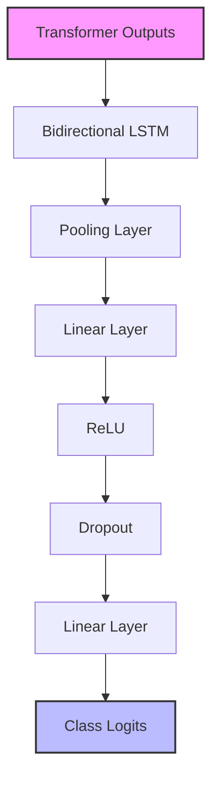
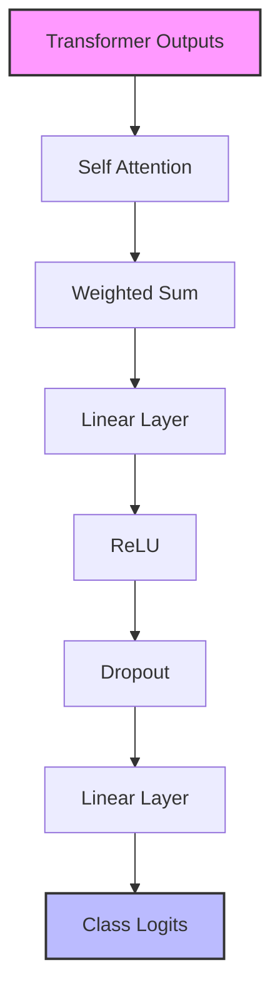
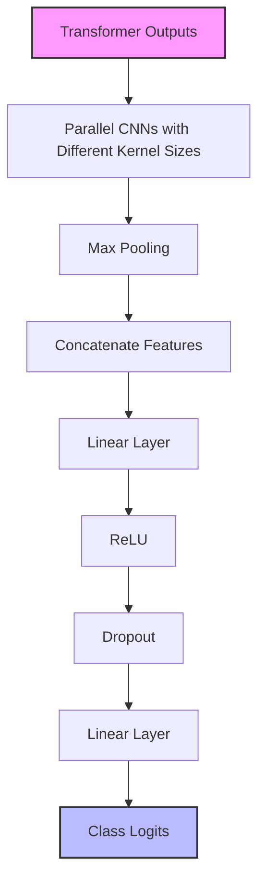
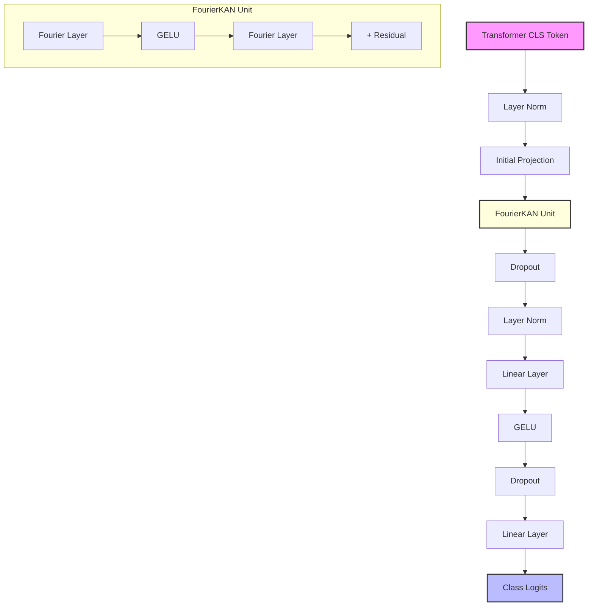
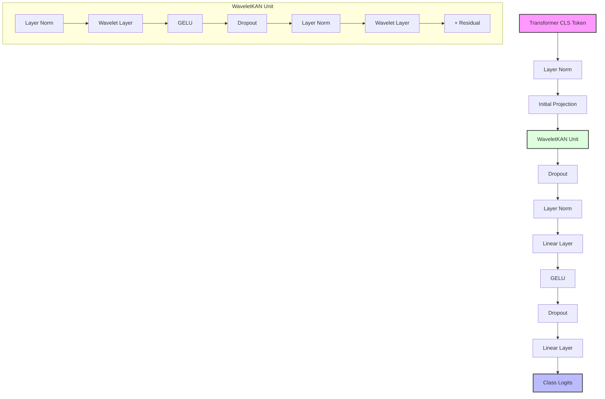

# HF Trainer Classifier

A modular framework for fine-tuning and benchmarking various text classification architectures using Hugging Face's transformer models and training utilities.

## Overview

This project provides a flexible and extensible solution for text classification tasks using Hugging Face's ecosystem. It allows you to:

1. Fine-tune various classifier architectures on top of pre-trained transformer models
2. Compare performance across different architectures
3. Visualize learning curves and metrics during training
4. Apply custom optimizers with different learning rates for transformer and classifier components
5. Automatically tune hyperparameters to find optimal configurations
6. Use advanced neural architectures including Kolmogorov-Arnold Networks (KANs)

## Key Features

- **Multiple Classifier Architectures**: Standard linear head, custom MLP, BiLSTM, self-attention, CNN-based, and KAN-based classifiers
- **Advanced KAN Architectures**: Fourier-based and Wavelet-based implementations of Kolmogorov-Arnold Networks
- **Differential Learning Rates**: Apply lower learning rates to pre-trained components and higher rates to new classifier layers
- **Integrated Evaluation**: Built-in metrics tracking and visualization
- **Hyperparameter Optimization**: Automatic tuning of hyperparameters using Optuna with aggressive pruning
- **Modular Design**: Easily extend with your own architectures or components

## Classifier Architectures

### Standard Classifier
Uses Hugging Face's `AutoModelForSequenceClassification` with a simple linear classification head.

```python
model = AutoModelForSequenceClassification.from_pretrained("bert-base-uncased", num_labels=5)
```

### Custom MLP Classifier
A multi-layer perceptron with multiple hidden layers, taking the [CLS] token representation as input.

```python
# Architecture:
# Input -> Linear -> ReLU -> Dropout -> Linear -> ReLU -> Dropout -> Linear -> Output
```

### BiLSTM Classifier
Processes transformer outputs through a bidirectional LSTM to capture sequential dependencies.

```python
# Architecture:
# Transformer outputs -> BiLSTM -> Linear -> ReLU -> Dropout -> Linear -> Output
```

### Attention Classifier
Applies a learned attention mechanism to weight the importance of different token positions in the sequence.

```python
# Architecture:
# Transformer outputs -> Self-Attention -> Weighted Sum -> Linear -> ReLU -> Dropout -> Linear -> Output
```

### CNN Classifier
Uses multiple parallel convolutional layers with different kernel sizes to capture n-gram patterns of different lengths.

```python
# Architecture:
# Transformer outputs -> Parallel CNNs -> MaxPooling -> Concatenate -> Linear -> ReLU -> Dropout -> Linear -> Output
```

### FourierKAN Classifier
Implements Kolmogorov-Arnold Networks (KANs) with Fourier basis functions to represent complex transformations more efficiently, often outperforming standard MLPs. KANs are based on the Kolmogorov-Arnold representation theorem, which states that any continuous multivariate function can be represented as combinations of continuous functions of one variable.

**Key Features:**
- Uses sine and cosine basis functions with learnable frequencies
- Residual connections throughout for better gradient flow
- Layer normalization for training stability
- Strong regularization to prevent overfitting
- Hybrid architecture combining Fourier components with direct linear pathways

```python
# Architecture:
# Transformer outputs -> Normalize -> Initial Projection -> 
#   FourierLayer (Linear + Sin/Cos projections) -> GELU -> Dropout -> 
#   FourierLayer -> Residual Add -> LayerNorm -> 
#   MLP Classification Head -> Output
```

**Training Options:**
```bash
# Basic usage with default settings
python hf_trainer_classifier.py --classifier fourier_kan

# With custom parameters
python hf_trainer_classifier.py --classifier fourier_kan --num-frequencies 24 --dropout 0.2 --learning-rate 1e-5
```

### WaveletKAN Classifier
Extends the KAN approach by using wavelets for multi-resolution analysis, capturing both frequency and spatial information simultaneously. Wavelets provide better localized feature extraction than Fourier transforms, excelling at representing both local details and global patterns.

**Key Features:**
- Supports multiple wavelet families (Haar, Mexican Hat, Morlet)
- Option to use mixed wavelet types for richer feature extraction
- Learnable scale and translation parameters
- Multi-resolution analysis capturing patterns at different scales
- Strong regularization and residual connections

**Wavelet Families:**
1. **Haar** - The simplest wavelet with compact support, good for capturing sharp transitions
2. **Mexican Hat** - Second derivative of Gaussian, good for blob detection and scale-space analysis
3. **Morlet** - Complex sinusoid modulated by Gaussian, good for capturing local frequency information

```python
# Architecture:
# Transformer outputs -> Normalize -> Initial Projection -> 
#   WaveletKAN Unit (Norm -> WaveletLayer -> GELU -> Dropout -> Norm -> WaveletLayer -> Residual) ->
#   LayerNorm -> MLP Classification Head -> Output
```

**Training Options:**
```bash
# Basic usage with mixed wavelet types
python hf_trainer_classifier.py --classifier wavelet_kan

# Using specific wavelet family
python hf_trainer_classifier.py --classifier wavelet_kan --wavelet-type haar
python hf_trainer_classifier.py --classifier wavelet_kan --wavelet-type mexican
python hf_trainer_classifier.py --classifier wavelet_kan --wavelet-type morlet

# With custom parameters
python hf_trainer_classifier.py --classifier wavelet_kan --num-frequencies 24 --wavelet-type mixed
```

## Installation

```bash
# Clone the repository
git clone https://github.com/yourusername/hf-trainer-classifier.git
cd hf-trainer-classifier

# Install dependencies
pip install -r requirements.txt
```

The requirements.txt file includes all necessary dependencies:

```
torch>=1.10.0
transformers>=4.16.0
datasets>=2.0.0
scikit-learn>=1.0.0
matplotlib>=3.5.0
seaborn>=0.11.0
pandas>=1.3.0
numpy>=1.20.0
optuna>=3.0.0
pyyaml>=6.0.0
```

## Usage Examples

### Command Line Interface (CLI)

The project provides a comprehensive command-line interface with many customizable options:

```bash
# Basic usage (train CNN classifier)
python hf_trainer_classifier.py

# Train a specific classifier with custom settings
python hf_trainer_classifier.py --classifier bilstm --epochs 5 --early-stopping 3 --dropout 0.5

# Train KAN classifiers
python hf_trainer_classifier.py --classifier fourier_kan --num-frequencies 16
python hf_trainer_classifier.py --classifier wavelet_kan --wavelet-type mixed --num-frequencies 16

# Train all classifiers with custom settings
python hf_trainer_classifier.py --train-all --batch-size 16 --metric f1_macro

# Compare existing trained models
python hf_trainer_classifier.py --compare

# Tune hyperparameters for a single classifier
python hf_trainer_classifier.py --tune --classifier fourier_kan --n-trials 20 --metric precision

# Tune hyperparameters for all classifiers
python hf_trainer_classifier.py --tune-all --n-trials 15 --tuning-epochs 3 --metric matthews_correlation

# Train with hyperparameters loaded from previous tuning
python hf_trainer_classifier.py --train --classifier wavelet_kan
```

### Available CLI Options

```
usage: hf_trainer_classifier.py [-h] [--train | --train-all | --compare | --tune | --tune-all]
                               [--model-name MODEL_NAME] [--model-path MODEL_PATH]
                               [--classifier {standard,custom,bilstm,attention,cnn,fourier_kan,wavelet_kan}]
                               [--classifiers CLASSIFIERS [CLASSIFIERS ...]]
                               [--data-path DATA_PATH] [--max-length MAX_LENGTH]
                               [--train-size TRAIN_SIZE] [--val-size VAL_SIZE]
                               [--test-size TEST_SIZE] [--epochs EPOCHS]
                               [--batch-size BATCH_SIZE] [--early-stopping EARLY_STOPPING]
                               [--metric {accuracy,precision,recall,f1_macro,matthews_correlation}]
                               [--n-trials N_TRIALS] [--tuning-epochs TUNING_EPOCHS]
                               [--hyperparams-dir HYPERPARAMS_DIR]
                               [--learning-rate LEARNING_RATE] [--weight-decay WEIGHT_DECAY]
                               [--dropout DROPOUT] [--num-frequencies NUM_FREQUENCIES]
                               [--num-wavelets NUM_WAVELETS]
                               [--wavelet-type {mixed,haar,mexican,morlet}]
                               [--no-cuda] [--output-dir OUTPUT_DIR] [--save-dir SAVE_DIR]
```

### Programmatic API

You can also use the project's Python API:

```python
import os
from pathlib import Path
from utils import train_classifier, train_all_classifiers, tune_classifier, tune_all_classifiers

# Set paths from environment variables using pathlib
model_path = Path(os.environ.get("LLM_MODELS_PATH", ".")) / "your-base-model-name"
data_path = Path(os.environ.get("DATADIR", ".")) / "your-dataset-folder" / "your-data.csv"

# Train a single classifier
results = train_classifier(
    classifier_type="custom",
    model_path=model_path,
    data_path=data_path,
    num_epochs=5,
    batch_size=8,
    dropout_rate=0.3,
    early_stopping_patience=2,
    metric_for_best_model="f1_macro"
)

# Train a FourierKAN classifier
results = train_classifier(
    classifier_type="fourier_kan",
    model_path=model_path,
    data_path=data_path,
    num_epochs=5,
    num_frequencies=16,
    dropout_rate=0.2
)

# Train a WaveletKAN classifier
results = train_classifier(
    classifier_type="wavelet_kan",
    model_path=model_path,
    data_path=data_path,
    num_epochs=5,
    num_wavelets=16,  # Use num_wavelets parameter instead of num_frequencies
    wavelet_type="mixed"
)

# Train and compare multiple classifiers
summary = train_all_classifiers(
    model_path=model_path,
    data_path=data_path,
    num_epochs=5,
    classifier_types=["standard", "custom", "bilstm", "attention", "cnn", "fourier_kan", "wavelet_kan"],
    metric_for_best_model="matthews_correlation",
    num_frequencies=16,  # For FourierKAN
    num_wavelets=16,     # For WaveletKAN
    wavelet_type="mixed" # For WaveletKAN
)

# Tune hyperparameters for a classifier
best_params = tune_classifier(
    classifier_type="fourier_kan",
    model_path=model_path,
    data_path=data_path,
    n_trials=20,
    num_epochs=3,
    metric_for_best_model="precision",
    save_dir="./hyperparams"
)

# Tune hyperparameters for all classifiers and find the best one
best_configs = tune_all_classifiers(
    model_path=model_path,
    data_path=data_path,
    n_trials=15,
    num_epochs=3,
    metric_for_best_model="matthews_correlation"
)

# Load best hyperparameter configuration for a classifier
from utils import load_best_config
config = load_best_config(
    classifier_type="wavelet_kan",
    output_dir="./hyperparams"
)

# Train with previously tuned hyperparameters
if config:
    results = train_classifier(
        classifier_type="wavelet_kan",
        model_path=model_path,
        data_path=data_path,
        num_epochs=10,
        **config["best_params"]  # Unpack the best parameters
    )
```

### Using a Pre-trained Classifier for Inference

```python
import os
import torch
import json
from pathlib import Path
from transformers import AutoTokenizer
from models import TextClassificationTrainer
from classifiers import CustomClassifier, FourierKANClassifier, WaveletKANClassifier

# Load the model and tokenizer (using local_files_only to prevent HF downloads)
model_path = Path("path/to/saved/model")
base_model_path = Path(os.environ.get("LLM_MODELS_PATH", ".")) / "your-base-model-name"
tokenizer = AutoTokenizer.from_pretrained(base_model_path, local_files_only=True)

# Load label mapping
with open(model_path / "label_mapping.json", "r") as f:
    mapping = json.load(f)
    id_to_label = mapping["id_to_label"]

# Load the model (choose the appropriate classifier class)
# model = CustomClassifier(base_model_path, num_labels=len(id_to_label))
# model = FourierKANClassifier(base_model_path, num_labels=len(id_to_label))
model = WaveletKANClassifier(base_model_path, num_labels=len(id_to_label))
model.load_state_dict(torch.load(model_path / "pytorch_model.bin"))
model.eval()

# Prepare input text
text = "This is a sample text for classification"
inputs = tokenizer(text, return_tensors="pt", padding=True, truncation=True, max_length=64)

# Get predictions
with torch.no_grad():
    outputs = model(**inputs)
    logits = outputs["logits"]
    predicted_class_id = logits.argmax().item()
    predicted_label = id_to_label[str(predicted_class_id)]

print(f"Predicted class: {predicted_label}")
```

### Custom Dataset Preparation

```python
import os
from pathlib import Path
from models import TextClassificationTrainer

# Initialize trainer with local model path from environment variable
model_path = Path(os.environ.get("LLM_MODELS_PATH", ".")) / "your-base-model-name"
trainer = TextClassificationTrainer(
    model_path=model_path,
    max_length=128  # Increase max sequence length for longer texts
)

# Prepare dataset with custom split and column names
data_path = Path(os.environ.get("DATADIR", ".")) / "your-dataset-folder" / "your-data.csv"
tokenized_datasets = trainer.prepare_data(
    dataset_path=data_path,
    text_column="content",  # Custom text column name
    label_column="category",  # Custom label column name
    train_size=0.7,
    val_size=0.15,
    test_size=0.15,
    random_state=42
)

# Continue with model setup and training
trainer.setup_trainer(tokenized_datasets, model_type="bilstm")
trainer.train(tokenized_datasets)
```

### Fine-tuning with Custom Training Parameters

```python
import os
from pathlib import Path
from models import TextClassificationTrainer

# Initialize trainer with custom hyperparameters using local paths
model_path = Path(os.environ.get("LLM_MODELS_PATH", ".")) / "your-base-model-name"
output_dir = Path("custom_results")
trainer = TextClassificationTrainer(
    model_path=model_path,
    num_labels=5,
    max_length=64,
    output_dir=output_dir,
    learning_rate=3e-5,
    batch_size=16,
    num_epochs=8,
    weight_decay=0.05
)

# Prepare data using environment variable for data path
data_path = Path(os.environ.get("DATADIR", ".")) / "your-dataset-folder" / "your-data.csv"
tokenized_datasets = trainer.prepare_data(data_path)
trainer.setup_trainer(tokenized_datasets, model_type="attention")
trainer.train(tokenized_datasets)

# Evaluate and save
test_results = trainer.evaluate(tokenized_datasets["test"])
save_path = Path("saved_models") / "attention_model"
trainer.save_model(save_path)
```

## Project Structure

```
HF_Trainer_Classifier/
├── callbacks/                  # Training callbacks
│   ├── __init__.py
│   └── learning_curve_callback.py  # Custom callback for tracking metrics and generating plots
├── classifiers/                # Model architectures
│   ├── __init__.py
│   ├── attention_classifier.py
│   ├── bilstm_classifier.py
│   ├── cnn_classifier.py
│   ├── custom_classifier.py
│   ├── fourier_kan_classifier.py  # Fourier-based KAN classifier
│   └── wavelet_kan_classifier.py  # Wavelet-based KAN classifier with multiple wavelet families
├── models/                     # Core training components
│   ├── __init__.py
│   └── text_classification_trainer.py
├── utils/                      # Utility functions
│   ├── __init__.py
│   ├── training_utils.py       # Training and evaluation utilities
│   └── tuning_utils.py         # Hyperparameter optimization with Optuna
├── hyperparams/                # Saved hyperparameter configurations
│   ├── all_best_configs.yaml   # Summary of all best configs
│   ├── best_overall_classifier.yaml # Best classifier information
│   └── *_best_config.yaml      # Classifier-specific best hyperparameters
│   └── */                      # Directory with training arguments for each classifier
├── results/                    # Training results and checkpoints
│   └── */                      # Classifier-specific results  
├── models/                     # Saved models
│   └── */                      # Classifier-specific models
├── evaluation/                 # Evaluation outputs
│   ├── */                      # Classifier-specific metrics and learning curves
│   └── classifier_comparison.png   # Comparison visualization
├── hf_trainer_classifier.py    # Main CLI script
├── requirements.txt            # Project dependencies
└── README.md
```

## Classifier Architecture Diagrams

Below are diagrams showing the different classifier architectures:

### Standard Classifier


### Custom MLP Classifier


### BiLSTM Classifier


### Attention Classifier


### CNN Classifier


### FourierKAN Classifier


### WaveletKAN Classifier


## Advanced Features

### Environment Variable Integration

The project is designed to work entirely with local models and data via environment variables:

- **$LLM_MODELS_PATH**: Points to the directory containing all model files
- **$DATADIR**: Points to the directory containing all datasets
- **No Downloads Required**: Uses `local_files_only=True` in all model loading
- **Production-Ready**: Designed to work in environments without internet access

### Hyperparameter Tuning with Optuna

The project includes comprehensive hyperparameter tuning support using Optuna:

- **Smart Trial Pruning**: Early detection and termination of underperforming trials
- **Persistent Storage**: Tuning results are stored in SQLite databases for resuming interrupted sessions
- **Targeted Parameter Spaces**: Customized parameter ranges for each classifier type
- **Trial Analysis**: Detailed metrics and analysis of each trial's performance
- **Configuration Management**: Save and load best hyperparameter configurations

### Wavelet-based KAN Implementation

The WaveletKAN classifier incorporates advanced features:

- **Multiple Wavelet Families**: Support for Haar, Mexican Hat, and Morlet wavelets
- **Mixed Wavelet Mode**: Combine different wavelet types for richer feature extraction
- **High-Frequency Optimization**: Special optimization for models with large numbers of wavelets
- **Multi-resolution Analysis**: Capture patterns at different scales simultaneously
- **Specialized Loss Functions**: Adaptive loss functions to prevent class imbalance issues

## Hugging Face Integration

This project leverages several key components from the Hugging Face ecosystem:

1. **Transformers Library**: Uses `AutoModel`, `AutoTokenizer`, and other components for loading pre-trained models

2. **Trainer API**: Utilizes Hugging Face's `Trainer` class for streamlined training with features like:
   - Automatic gradient accumulation
   - Mixed precision training
   - Learning rate scheduling
   - Checkpointing
   - Evaluation during training
   - Automatic GPU/MPS acceleration
   - Support for Apple Silicon via MPS device

3. **Datasets Library**: Employs the `Dataset` and `DatasetDict` classes for efficient data handling with features like:
   - Memory-mapped storage
   - Efficient data transformations
   - Batched processing
   - Easy integration with the Trainer API

4. **Model Hub Integration**: Support for loading models directly from Hugging Face's model hub

## License

This project is licensed under the MIT License - see the LICENSE file for details.

## Acknowledgments

- Hugging Face for their excellent transformers and datasets libraries
- PyTorch for the underlying deep learning framework