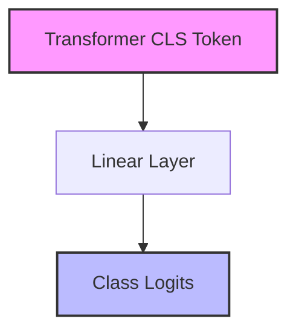
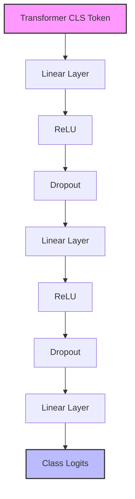
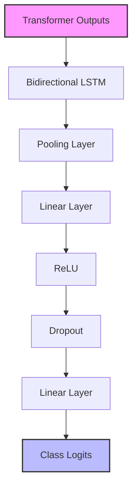
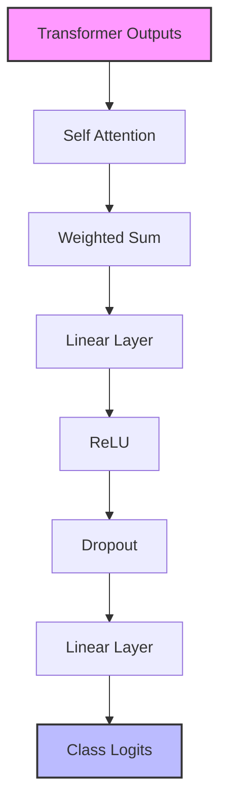
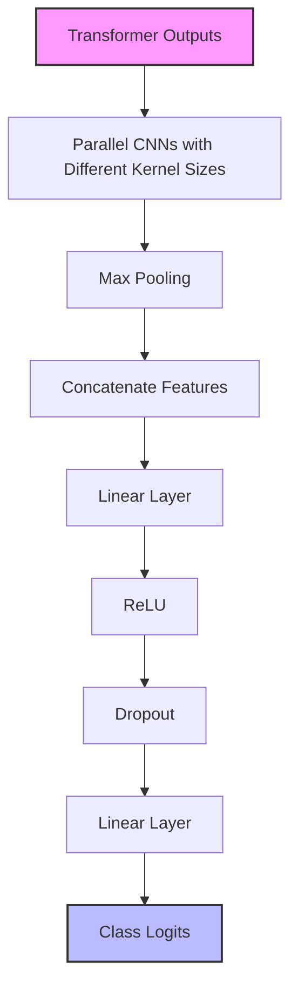
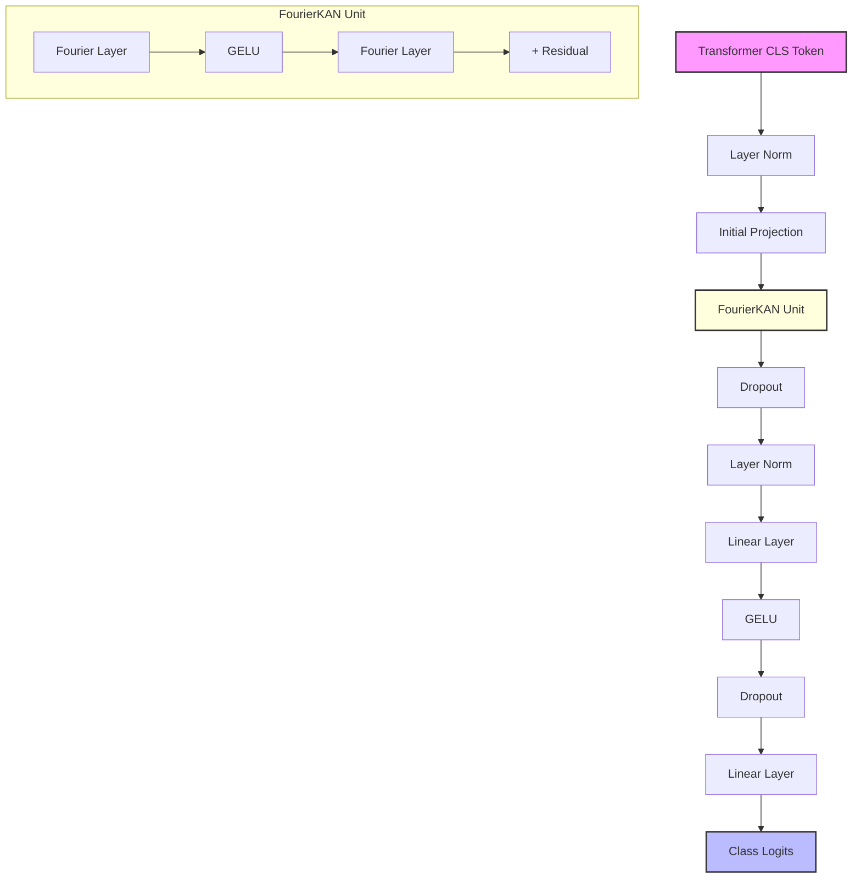
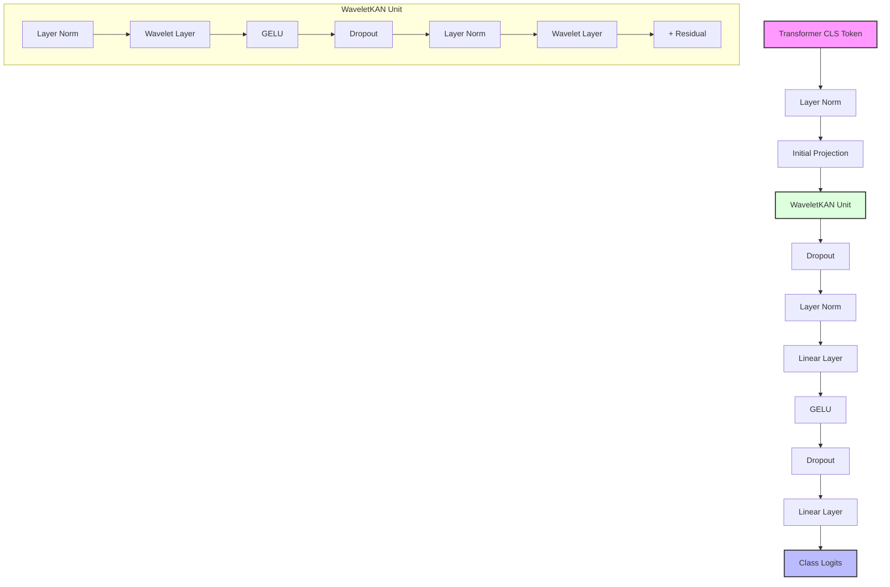

# HF Trainer Classifier

A modular framework for fine-tuning and benchmarking various text classification architectures using Hugging Face's transformer models and training utilities.

## Overview

This project provides a flexible and extensible solution for text classification tasks using Hugging Face's ecosystem. It allows you to:

1. Fine-tune various classifier architectures on top of pre-trained transformer models
2. Compare performance across different architectures
3. Visualize learning curves and metrics during training
4. Apply custom optimizers with different learning rates for transformer and classifier components
5. Automatically tune hyperparameters to find optimal configurations
6. Use advanced neural architectures including Kolmogorov-Arnold Networks (KANs)

## Key Features

- **Multiple Classifier Architectures**: Standard linear head, BiLSTM, self-attention, CNN-based, and KAN-based classifiers with specialized pooling strategies
- **Advanced KAN Architectures**: Fourier-based and Wavelet-based implementations of Kolmogorov-Arnold Networks
- **Differential Learning Rates**: Apply lower learning rates to pre-trained components and higher rates to new classifier layers
- **Integrated Evaluation**: Built-in metrics tracking and visualization
- **Hyperparameter Optimization**: Automatic tuning of hyperparameters using Optuna with aggressive pruning
- **Modular Design**: Easily extend with your own architectures or components

## Classifier Architectures

### Standard Classifier
Uses Hugging Face's `AutoModelForSequenceClassification` with a simple linear classification head.

```python
model = AutoModelForSequenceClassification.from_pretrained("bert-base-uncased", num_labels=5)
```

### Pooling Strategy Classifiers
Specialized classifiers with different pooling strategies for transformer outputs.

```python
# Mean Pooling:
# Transform outputs -> Average across sequence -> Linear layers -> Output

# Combined Pooling:
# Transform outputs -> [CLS token + Mean pooling] -> Linear layers -> Output
```

### BiLSTM Classifier
Processes transformer outputs through a bidirectional LSTM to capture sequential dependencies. The BiLSTM architecture excels at modeling contextual information and sequential dependencies in text.

**Key Features:**
- Bidirectional processing captures context from both directions
- LSTM cells mitigate vanishing gradient problems and maintain long-range dependencies
- Support for multilayer transformer representations with separate BiLSTMs for each layer
- Layer normalization for training stability
- Configurable hidden size and dropout rate

```python
# Architecture:
# Single Layer Mode:
# Transformer outputs -> BiLSTM -> Final hidden state -> Dropout -> Linear -> Output

# Multilayer Mode:
# Multiple transformer layers -> Separate BiLSTMs -> Concatenate outputs -> LayerNorm -> Dropout -> Linear -> Output
```

The BiLSTM is especially effective when:
- Sequence order and relationships between tokens are critical
- The task requires understanding of long-range dependencies
- Contextual information needs to be preserved

### Attention Classifier
Implements a learned self-attention mechanism that dynamically focuses on the most relevant parts of the input sequence, allowing the model to weight token representations based on their importance to the classification task.

**Key Features:**
- Self-attention mechanism learns to focus on task-relevant tokens
- Supports multilayer transformer representations for richer feature extraction
- Separate attention modules for each transformer layer when using multilayer mode
- Layer normalization for improved training stability
- GELU activation for better performance (compared to ReLU)
- Deeper classification network with regularization
- Optional label smoothing to reduce overconfidence and improve generalization

```python
# Architecture:
# Single Layer Mode:
# Transformer outputs -> Self-Attention -> Weighted Sum -> Dropout -> MLP (GELU activation) -> Output

# Multilayer Mode:
# Multiple transformer layers -> Layer-specific attention modules -> Concatenate attention outputs ->
# LayerNorm -> Dropout -> MLP (GELU activation) -> Output
```

The attention classifier excels in scenarios where:
- Different parts of the input have varying importance to the classification decision
- The task requires focusing on specific terms or phrases within longer text
- Interpretability is desired (attention weights can be visualized)

### CNN Classifier
Employs a convolutional neural network architecture to extract local patterns and n-gram features from transformer outputs. The CNN applies multiple parallel filters with different kernel sizes to capture patterns of varying lengths, effectively modeling different n-gram combinations.

**Key Features:**
- Multiple parallel CNN filters (kernel sizes 3, 4, and 5) capture diverse linguistic patterns
- Adaptive max pooling for dimension reduction and feature selection
- Support for multilayer transformer representations
- Feature maps optimized to reduce overfitting while maintaining expressiveness
- Layer normalization for better training stability
- Configurable dropout rate for regularization

```python
# Architecture:
# Single Layer Mode:
# Transformer outputs -> Parallel CNNs (3 kernel sizes) -> Max Pooling -> Concatenate -> Dropout -> Linear -> Output

# Multilayer Mode:
# Multiple transformer layers -> Layer-specific CNN processing -> Concatenate all extracted features ->
# LayerNorm -> Dropout -> Linear -> Output
```

The CNN classifier is particularly effective for:
- Capturing local feature patterns regardless of their position in the sequence
- Identifying key n-gram patterns and phrase-level features
- Processing longer sequences efficiently through hierarchical feature extraction

### FourierKAN Classifier
Implements Kolmogorov-Arnold Networks (KANs) with Fourier basis functions to represent complex transformations more efficiently, often outperforming standard MLPs. KANs are based on the Kolmogorov-Arnold representation theorem, which states that any continuous multivariate function can be represented as combinations of continuous functions of one variable.

**Key Features:**
- Uses sine and cosine basis functions with learnable frequencies
- Residual connections throughout for better gradient flow
- Layer normalization for training stability
- Strong regularization to prevent overfitting
- Hybrid architecture combining Fourier components with direct linear pathways

```python
# Architecture:
# Transformer outputs -> Normalize -> Initial Projection -> 
#   FourierLayer (Linear + Sin/Cos projections) -> GELU -> Dropout -> 
#   FourierLayer -> Residual Add -> LayerNorm -> 
#   MLP Classification Head -> Output
```

**Training Options:**
```bash
# Basic usage with default settings
python hf_trainer_classifier.py --classifier fourier_kan

# With custom parameters
python hf_trainer_classifier.py --classifier fourier_kan --num-frequencies 24 --dropout 0.2 --learning-rate 1e-5
```

### WaveletKAN Classifier
Extends the KAN approach by implementing wavelet transforms for multi-resolution analysis, simultaneously capturing both frequency and spatial information. Wavelets provide better localized feature extraction than Fourier transforms, excelling at representing both local details and global patterns in the data.

**Key Features:**
- Multiple wavelet families with different mathematical properties:
  - Haar wavelets for capturing sharp transitions and discontinuities
  - Daubechies wavelets (db2, db4) for smoother, more compact representations
  - Option to use mixed wavelet types for complementary feature extraction
- Learnable scale and translation parameters for adaptive feature extraction
- Special high-frequency mode for Haar wavelets with memory optimization
- Multi-resolution analysis capturing patterns at different scales simultaneously
- Strong residual connections throughout the architecture for better gradient flow
- Advanced regularization techniques including:
  - Label smoothing to reduce overconfidence
  - Focal loss to focus on harder examples
  - Class balance regularization to prevent single-class predictions
  - Entropy regularization to encourage diverse predictions
- Support for multilayer transformer representations
- Layer normalization for training stability

**Wavelet Families Implemented:**
1. **Haar** - The simplest wavelet family with compact support, excellent for capturing sharp transitions and discontinuities in data
2. **Daubechies 2 (db2)** - Low-order Daubechies wavelet with 4 coefficients, providing excellent time-frequency localization
3. **Daubechies 4 (db4)** - Higher-order Daubechies wavelet with 8 coefficients, offering increased smoothness and vanishing moments
4. **Mixed** - A combination of multiple wavelet families to leverage their complementary properties

```python
# Architecture:
# Single Layer Mode:
# Transformer outputs -> Pooling (CLS or combined) -> Normalize -> Initial Projection -> MLP ->
#   WaveletLayer (Linear path + Wavelet transforms) -> Residual connection -> LayerNorm ->
#   Classification Head with regularization -> Output

# Multilayer Mode:
# Multiple transformer layers -> Layer-specific wavelet processing ->
#   Concatenate all processed layers -> Final LayerNorm ->
#   Classification Head with regularization -> Output

# WaveletLayer detailed:
# Input -> Direct linear path + 
#   (Project to wavelet space -> Apply wavelet transforms -> 
#    GELU activation -> Combine wavelet outputs) ->
#   Add paths -> LayerNorm -> Output
```

**Training Options:**
```bash
# Basic usage with mixed wavelet types (combines Haar, db2, and db4)
python hf_trainer_classifier.py --classifier wavelet_kan

# Using specific wavelet family
python hf_trainer_classifier.py --classifier wavelet_kan --wavelet-type haar
python hf_trainer_classifier.py --classifier wavelet_kan --wavelet-type db2
python hf_trainer_classifier.py --classifier wavelet_kan --wavelet-type db4

# With custom parameters
python hf_trainer_classifier.py --classifier wavelet_kan --num-wavelets 24 --wavelet-type mixed
```

## Installation

```bash
# Clone the repository
git clone https://github.com/yourusername/hf-trainer-classifier.git
cd hf-trainer-classifier

# Install dependencies
pip install -r requirements.txt
```

The requirements.txt file includes all necessary dependencies:

```
torch>=1.10.0
transformers>=4.16.0
datasets>=2.0.0
scikit-learn>=1.0.0
matplotlib>=3.5.0
seaborn>=0.11.0
pandas>=1.3.0
numpy>=1.20.0
optuna>=3.0.0
pyyaml>=6.0.0
```

## Usage Examples

### Command Line Interface (CLI)

The project provides a comprehensive command-line interface with many customizable options:

```bash
# Basic usage (train CNN classifier)
python hf_trainer_classifier.py

# Train a specific classifier with custom settings
python hf_trainer_classifier.py --classifier bilstm --epochs 5 --early-stopping 3 --dropout 0.5

# Train KAN classifiers
python hf_trainer_classifier.py --classifier fourier_kan --num-frequencies 16
python hf_trainer_classifier.py --classifier wavelet_kan --wavelet-type mixed --num-frequencies 16

# Train with multilayer pooling (using outputs from multiple transformer layers)
python hf_trainer_classifier.py --classifier attention --use-multilayer --num-layers-to-use 3
python hf_trainer_classifier.py --classifier cnn --use-multilayer --num-layers-to-use 4
python hf_trainer_classifier.py --classifier wavelet_kan --use-multilayer --wavelet-type haar

# Train with combined pooling and multilayer outputs
python hf_trainer_classifier.py --classifier combined_pooling --use-multilayer --num-layers-to-use 3

# Train all classifiers with custom settings
python hf_trainer_classifier.py --train-all --metric f1_macro

# Compare existing trained models
python hf_trainer_classifier.py --compare

# Tune hyperparameters for a single classifier
python hf_trainer_classifier.py --tune --classifier fourier_kan --n-trials 20 --metric precision

# Tune hyperparameters for all classifiers
python hf_trainer_classifier.py --tune-all --n-trials 15 --tuning-epochs 3 --metric matthews_correlation

# Train with hyperparameters loaded from previous tuning
python hf_trainer_classifier.py --train --classifier wavelet_kan
```

### Available CLI Options

```
usage: hf_trainer_classifier.py [-h] [--train | --train-all | --compare | --tune | --tune-all]
                               [--model-name MODEL_NAME] [--model-path MODEL_PATH]
                               [--classifier {standard,bilstm,attention,cnn,fourier_kan,wavelet_kan,mean_pooling,combined_pooling}]
                               [--classifiers CLASSIFIERS [CLASSIFIERS ...]]
                               [--data-path DATA_PATH] [--max-length MAX_LENGTH]
                               [--train-size TRAIN_SIZE] [--val-size VAL_SIZE]
                               [--test-size TEST_SIZE] [--epochs EPOCHS]
                               [--batch-size BATCH_SIZE] [--early-stopping EARLY_STOPPING]
                               [--metric {accuracy,precision,recall,f1_macro,matthews_correlation}]
                               [--n-trials N_TRIALS] [--tuning-epochs TUNING_EPOCHS]
                               [--hyperparams-dir HYPERPARAMS_DIR]
                               [--learning-rate LEARNING_RATE] [--weight-decay WEIGHT_DECAY]
                               [--dropout DROPOUT] [--num-frequencies NUM_FREQUENCIES]
                               [--num-wavelets NUM_WAVELETS]
                               [--wavelet-type {mixed,haar,db2,db4}]
                               [--use-multilayer] [--num-layers-to-use NUM_LAYERS_TO_USE]
                               [--no-cuda] [--output-dir OUTPUT_DIR] [--save-dir SAVE_DIR]
```

### Programmatic API

You can also use the project's Python API:

```python
import os
from pathlib import Path
from utils import train_classifier, train_all_classifiers, tune_classifier, tune_all_classifiers

# Set paths from environment variables using pathlib
model_path = Path(os.environ.get("LLM_MODELS_PATH", ".")) / "your-base-model-name"
data_path = Path(os.environ.get("DATADIR", ".")) / "your-dataset-folder" / "your-data.csv"

# Train a single classifier
results = train_classifier(
    classifier_type="attention",
    model_path=model_path,
    data_path=data_path,
    num_epochs=5,
    batch_size=8,
    dropout_rate=0.3,
    early_stopping_patience=2,
    metric_for_best_model="f1_macro"
)

# Train a FourierKAN classifier
results = train_classifier(
    classifier_type="fourier_kan",
    model_path=model_path,
    data_path=data_path,
    num_epochs=5,
    num_frequencies=16,
    dropout_rate=0.2
)

# Train a WaveletKAN classifier
results = train_classifier(
    classifier_type="wavelet_kan",
    model_path=model_path,
    data_path=data_path,
    num_epochs=5,
    num_wavelets=16,  # Use num_wavelets parameter instead of num_frequencies
    wavelet_type="mixed"
)

# Train a classifier with the multilayer approach
results = train_classifier(
    classifier_type="attention",
    model_path=model_path,
    data_path=data_path,
    num_epochs=5,
    dropout_rate=0.2,
    use_multilayer=True,  # Enable multilayer output
    num_layers_to_use=3   # Use the last 3 transformer layers
)

# Train with combined pooling and multilayer approach
results = train_classifier(
    classifier_type="combined_pooling",  # This uses the custom classifier with combined pooling
    model_path=model_path,
    data_path=data_path,
    num_epochs=5,
    use_multilayer=True,          # Enable multilayer output
    num_layers_to_use=4           # Use the last 4 transformer layers
)

# Train and compare multiple classifiers
summary = train_all_classifiers(
    model_path=model_path,
    data_path=data_path,
    num_epochs=5,
    classifier_types=["standard", "custom", "bilstm", "attention", "cnn", "fourier_kan", "wavelet_kan"],
    metric_for_best_model="matthews_correlation",
    num_frequencies=16,    # For FourierKAN
    num_wavelets=16,       # For WaveletKAN
    wavelet_type="mixed",  # For WaveletKAN
    use_multilayer=True,   # Enable multilayer output for all classifiers
    num_layers_to_use=3    # Use the last 3 transformer layers for all classifiers
)

# Tune hyperparameters for a classifier
best_params = tune_classifier(
    classifier_type="fourier_kan",
    model_path=model_path,
    data_path=data_path,
    n_trials=20,
    num_epochs=3,
    metric_for_best_model="precision",
    save_dir="./hyperparams"
)

# Tune hyperparameters for all classifiers and find the best one
best_configs = tune_all_classifiers(
    model_path=model_path,
    data_path=data_path,
    n_trials=15,
    num_epochs=3,
    metric_for_best_model="matthews_correlation"
)

# Load best hyperparameter configuration for a classifier
from utils import load_best_config
config = load_best_config(
    classifier_type="wavelet_kan",
    output_dir="./hyperparams"
)

# Train with previously tuned hyperparameters
if config:
    results = train_classifier(
        classifier_type="wavelet_kan",
        model_path=model_path,
        data_path=data_path,
        num_epochs=10,
        **config["best_params"]  # Unpack the best parameters
    )
```

### Using a Pre-trained Classifier for Inference

```python
import os
import torch
import json
from pathlib import Path
from transformers import AutoTokenizer
from models import TextClassificationTrainer
from classifiers import FourierKANClassifier, WaveletKANClassifier, AttentionClassifier

# Load the model and tokenizer (using local_files_only to prevent HF downloads)
model_path = Path("path/to/saved/model")
base_model_path = Path(os.environ.get("LLM_MODELS_PATH", ".")) / "your-base-model-name"
tokenizer = AutoTokenizer.from_pretrained(base_model_path, local_files_only=True)

# Load label mapping
with open(model_path / "label_mapping.json", "r") as f:
    mapping = json.load(f)
    id_to_label = mapping["id_to_label"]

# Load the model (choose the appropriate classifier class)
# model = AttentionClassifier(base_model_path, num_labels=len(id_to_label))
# model = FourierKANClassifier(base_model_path, num_labels=len(id_to_label))
model = WaveletKANClassifier(base_model_path, num_labels=len(id_to_label))
model.load_state_dict(torch.load(model_path / "pytorch_model.bin"))
model.eval()

# Prepare input text
text = "This is a sample text for classification"
inputs = tokenizer(text, return_tensors="pt", padding=True, truncation=True, max_length=64)

# Get predictions
with torch.no_grad():
    outputs = model(**inputs)
    logits = outputs["logits"]
    predicted_class_id = logits.argmax().item()
    predicted_label = id_to_label[str(predicted_class_id)]

print(f"Predicted class: {predicted_label}")
```

### Custom Dataset Preparation

```python
import os
from pathlib import Path
from models import TextClassificationTrainer

# Initialize trainer with local model path from environment variable
model_path = Path(os.environ.get("LLM_MODELS_PATH", ".")) / "your-base-model-name"
trainer = TextClassificationTrainer(
    model_path=model_path,
    max_length=128  # Increase max sequence length for longer texts
)

# Prepare dataset with custom split and column names
data_path = Path(os.environ.get("DATADIR", ".")) / "your-dataset-folder" / "your-data.csv"
tokenized_datasets = trainer.prepare_data(
    dataset_path=data_path,
    text_column="content",  # Custom text column name
    label_column="category",  # Custom label column name
    train_size=0.7,
    val_size=0.15,
    test_size=0.15,
    random_state=42
)

# Continue with model setup and training
trainer.setup_trainer(tokenized_datasets, model_type="bilstm")
trainer.train(tokenized_datasets)
```

### Fine-tuning with Custom Training Parameters

```python
import os
from pathlib import Path
from models import TextClassificationTrainer

# Initialize trainer with custom hyperparameters using local paths
model_path = Path(os.environ.get("LLM_MODELS_PATH", ".")) / "your-base-model-name"
output_dir = Path("custom_results")
trainer = TextClassificationTrainer(
    model_path=model_path,
    num_labels=5,
    max_length=64,
    output_dir=output_dir,
    learning_rate=3e-5,
    batch_size=16,
    num_epochs=8,
    weight_decay=0.05
)

# Prepare data using environment variable for data path
data_path = Path(os.environ.get("DATADIR", ".")) / "your-dataset-folder" / "your-data.csv"
tokenized_datasets = trainer.prepare_data(data_path)
trainer.setup_trainer(tokenized_datasets, model_type="attention")
trainer.train(tokenized_datasets)

# Evaluate and save
test_results = trainer.evaluate(tokenized_datasets["test"])
save_path = Path("saved_models") / "attention_model"
trainer.save_model(save_path)
```

## Project Structure

```
HF_Trainer_Classifier/
├── callbacks/                  # Training callbacks
│   ├── __init__.py
│   └── learning_curve_callback.py  # Custom callback for tracking metrics and generating plots
├── classifiers/                # Model architectures
│   ├── __init__.py
│   ├── attention_classifier.py
│   ├── bilstm_classifier.py
│   ├── cnn_classifier.py
│   ├── custom_classifier.py       # Used by mean_pooling and combined_pooling
│   ├── fourier_kan_classifier.py  # Fourier-based KAN classifier
│   └── wavelet_kan_classifier.py  # Wavelet-based KAN classifier with Haar and Daubechies wavelets
├── models/                     # Core training components
│   ├── __init__.py
│   └── text_classification_trainer.py
├── utils/                      # Utility functions
│   ├── __init__.py
│   ├── training_utils.py       # Training and evaluation utilities
│   └── tuning_utils.py         # Hyperparameter optimization with Optuna
├── hyperparams/                # Saved hyperparameter configurations
│   ├── all_best_configs.yaml   # Summary of all best configs
│   ├── best_overall_classifier.yaml # Best classifier information
│   └── *_best_config.yaml      # Classifier-specific best hyperparameters
│   └── */                      # Directory with training arguments for each classifier
├── results/                    # Training results and checkpoints
│   └── */                      # Classifier-specific results  
├── models/                     # Saved models
│   └── */                      # Classifier-specific models
├── evaluation/                 # Evaluation outputs
│   ├── */                      # Classifier-specific metrics and learning curves
│   └── classifier_comparison.png   # Comparison visualization
├── hf_trainer_classifier.py    # Main CLI script
├── requirements.txt            # Project dependencies
└── README.md
```

## Classifier Architecture Diagrams

Below are diagrams showing the different classifier architectures:

### Standard Classifier


### Custom MLP Classifier


### BiLSTM Classifier


### Attention Classifier


### CNN Classifier


### FourierKAN Classifier


### WaveletKAN Classifier


## Advanced Features

### Multilayer Representation

The classifiers can leverage outputs from multiple transformer layers for improved performance:

- **Multi-Layer Output**: Access hidden states from multiple transformer layers instead of just the final layer
- **Wider Representations**: Concatenate outputs from multiple layers for richer feature extraction
- **Layer Combination**: Apply the same classifier architecture to each layer and combine results
- **Pooling Strategies**: Use different pooling strategies (CLS, mean, combined) with multilayer outputs
- **Configurable Depth**: Control how many layers to use with the `num_layers_to_use` parameter
- **Multiple Architectures**: Available for all classifier types (attention, CNN, custom, KAN, etc.)
- **Standardized Hyperparameters**: Batch size (16) and learning rate schedules are standardized across all models for fair comparison

```bash
# Use with any classifier type
python hf_trainer_classifier.py --classifier attention --use-multilayer --num-layers-to-use 3

# Combine with pooling strategies
python hf_trainer_classifier.py --classifier custom --pooling-strategy combined --use-multilayer
```

### Environment Variable Integration

The project is designed to work entirely with local models and data via environment variables:

- **$LLM_MODELS_PATH**: Points to the directory containing all model files
- **$DATADIR**: Points to the directory containing all datasets
- **No Downloads Required**: Uses `local_files_only=True` in all model loading
- **Production-Ready**: Designed to work in environments without internet access

### Hyperparameter Tuning with Optuna

The project includes comprehensive hyperparameter tuning support using Optuna:

- **Smart Trial Pruning**: Early detection and termination of underperforming trials
- **Persistent Storage**: Tuning results are stored in SQLite databases for resuming interrupted sessions
- **Targeted Parameter Spaces**: Customized parameter ranges for each classifier type
- **Trial Analysis**: Detailed metrics and analysis of each trial's performance
- **Configuration Management**: Save and load best hyperparameter configurations

### Wavelet-based KAN Implementation

The WaveletKAN classifier incorporates advanced features:

- **Multiple Wavelet Families**: Support for Haar, Daubechies 2 (db2), and Daubechies 4 (db4) wavelets
- **Mixed Wavelet Mode**: Combine different wavelet types for richer feature extraction
- **High-Frequency Optimization**: Special optimization for models with large numbers of wavelets
- **Multi-resolution Analysis**: Capture patterns at different scales simultaneously
- **Specialized Loss Functions**: Adaptive loss functions to prevent class imbalance issues

## Hugging Face Integration

This project leverages several key components from the Hugging Face ecosystem:

1. **Transformers Library**: Uses `AutoModel`, `AutoTokenizer`, and other components for loading pre-trained models

2. **Trainer API**: Utilizes Hugging Face's `Trainer` class for streamlined training with features like:
   - Automatic gradient accumulation
   - Mixed precision training
   - Learning rate scheduling
   - Checkpointing
   - Evaluation during training
   - Automatic GPU/MPS acceleration
   - Support for Apple Silicon via MPS device

3. **Datasets Library**: Employs the `Dataset` and `DatasetDict` classes for efficient data handling with features like:
   - Memory-mapped storage
   - Efficient data transformations
   - Batched processing
   - Easy integration with the Trainer API

4. **Model Hub Integration**: Support for loading models directly from Hugging Face's model hub

## License

This project is licensed under the MIT License - see the LICENSE file for details.

## Acknowledgments

- Hugging Face for their excellent transformers and datasets libraries
- PyTorch for the underlying deep learning framework